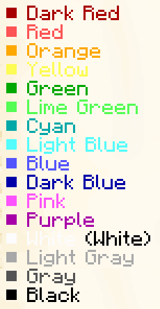

# MineTeX Document Specification
A very simple TeX-inspired typesetter for Minecraft Written Books.
It serves two purposes — converting existing text documents easily into strictly paginated Minecraft books,
and to author new Minecraft books without spending half of the time dealing with page limitations.
## Commands
### Styles
Command styles are applied until the next line break or page, or until the reset command is given.
- `\colour{<colour>}` applies the given colour to the following text. See below for allowed colours.
- `\bold` makes the following text bold.
- `\italic` makes the following text italic.
- `\underline` underlines the following text.
- `\garble` makes the following text animated garbled.
- `\reset` resets all styles immediately.

### Layout
- `\pagebreak` forces a page break even if it otherwise would not.
- `\align{<mode>}` forces the line(s) to be aligned according to the given mode. Allowed modes are `left`, `right`, `center`, and `justify`.

## Colours
Minecraft books have 16 available colours, including the default black.

| Accepted Colour Names                    |
|------------------------------------------|
| `dark red`                               |
| `red`, `light red`                       |
| `orange`                                 |
| `yellow`                                 |
| `green`, `dark green`                    |
| `lime`, `lime green`, `light green`      |
| `cyan`                                   |
| `light blue`                             |
| `blue`                                   |
| `dark blue`                              |
| `pink`, `magenta`                        |
| `purple`                                 |
| `white`                                  |
| `light gray`, `light grey`               |
| `gray`, `grey`, `dark gray`, `dark grey` |
| `black`                                  |

[//]: # ()

**The available colours, demonstrated in a Minecraft book:** 

## Styles
Minecraft books offer limited styling, but include the basics: bold, italic, underlined,
as well as a Minecraft-unique style which garbles the text so it is unreadable, and is also animated.